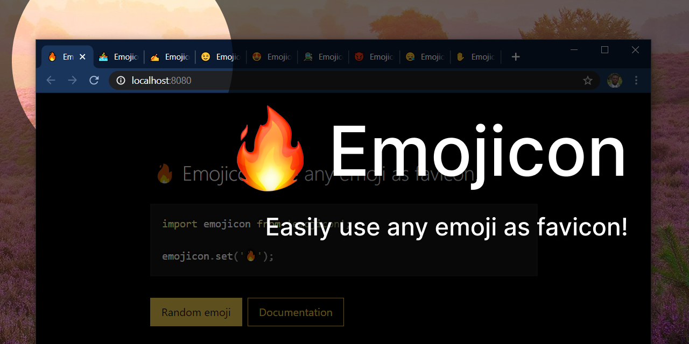

# Emojicon

Emojicon is a small JS library that allows you to dynamically change a page's favicon to any emoji.



This project is part of [#CreateWeekly](https://dev.to/josephuspaye/createweekly-create-something-new-publicly-every-week-in-2020-1nh9), my attempt to create something new publicly every week in 2020.

## Features

With Emojicon you can:

- Dynamically change the favicon to any emoji
- Specify custom emoji color (for some older monochrome emojis)
- Render emoji to a data URL without changing page favicon
- Use a custom canvas for rendering (e.g. in Node, for SSR)

Emojicon is tiny and has no dependencies - weighing only 939 bytes (603 bytes g-zipped).

## Design

Emojicon works as follows:

- Renders the given emoji to a 32x32 transparent canvas using the platform's emoji font
- Converts the canvas image to a data URL using [`canvas.toDataURL('image/png')`](https://developer.mozilla.org/en-US/docs/Web/API/HTMLCanvasElement/toDataURL)
- Changes the page's favicon by setting the `href` attribute on the favicon `<link>` element in the document head

## Installation

```
npm install emojicon --save
```

## Usage

Before using Emojicon, ensure that your favicon `<link>` element in the document head has an id of `emojicon`, or pass `linkId` with the actual id when calling `set()` or `render()`.

```html
<link rel="shortcut icon" id="emojicon" href="/favicon.ico" />
```

### Set the page emoji

```js
import emojicon from 'emojicon';

emojicon.set('🔥');
```

### Change the emoji color

This only works for some older monochrome emojis.

```js
import emojicon from 'emojicon';

emojicon.set('✷', { color: '#EA0' });
```

### Change the emoji color for dark mode

```js
import emojicon from 'emojicon';

function getEmojiColor() {
  // Check for dark mode support
  if (window.matchMedia('(prefers-color-scheme)').media !== 'not all') {
    return window.matchMedia('(prefers-color-scheme: dark)').matches
      ? '#fff'
      : '#000';
  }

  // Default to black
  return '#000';
}

emojicon.set('🔥', { color: getEmojiColor() });
```

### Render the emoji to a data URL

```js
import emojicon from 'emojicon';

const faviconUrl = emojicon.render('🔥');

// Use `faviconUrl` anywhere you would use an image URL
```

### Use a custom canvas for rendering

A custom canvas is useful when running in an environment that doesn't have `<canvas>` available natively (e.g. Node).

```js
const emojicon = require('emojicon');
const { createCanvas } = require('canvas'); // npm install canvas

const faviconUrl = emojicon.render('🔥', { canvas: createCanvas(32, 32) });

// Use `faviconUrl` to set the favicon <link> element's `href` attribute
```

Note that Node Canvas's emoji support [is not that great](https://github.com/Automattic/node-canvas/issues/760). You are probably better off using a default favicon server-side and setting the emoji favicon client-side when the page loads.

### Use Emojicon from a CDN

Add Emojicon to your list of scripts:

```html
<script src="https://unpkg.com/emojicon"></script>
```

Then use it anywhere in JS via the global `emojicon` variable:

```js
emojicon.set('🔥');
```

## API

### `emojicon.set(emoji, [options])`

Set the page's favicon to the given emoji.

- `emoji`: String (required): the emoji (should contain one emoji only)
- `options`: Object (optional) with any of the following properties:
  - `linkId`: String: id of the favicon `<link>` element to set the emoji on, defaults to `emojicon`
  - `color`: String: color of the emoji (any CSS color string)
  - `canvas`: Object: a custom canvas implementation, must be compatible with the [standard canvas API](https://developer.mozilla.org/en-US/docs/Web/API/Canvas_API)

### `emojicon.render(emoji, [options])`

Render the given emoji to a data URL.

- `emoji`: String (required): the emoji (should contain one emoji only)
- `options`: Object (optional) with any of the following properties:
  - `color`: String: color of the emoji (any valid CSS color string)
  - `canvas`: Object: a custom canvas implementation, must be compatible with the [standard canvas API](https://developer.mozilla.org/en-US/docs/Web/API/Canvas_API)

Returns a data URL string that can be used anywhere you would use an image URL.

## Licence

[MIT](LICENCE)
